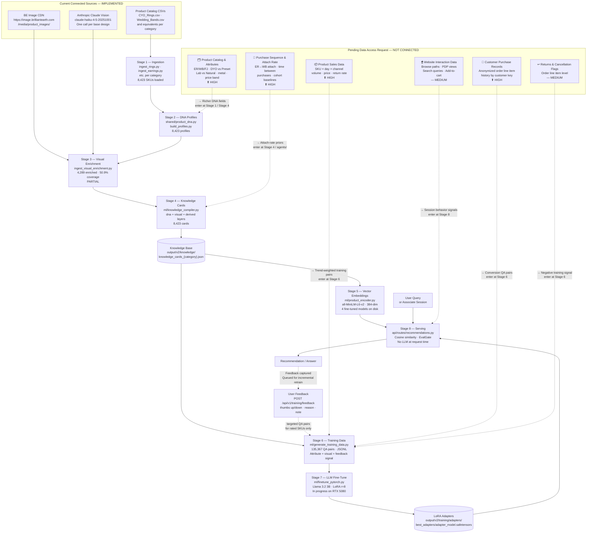
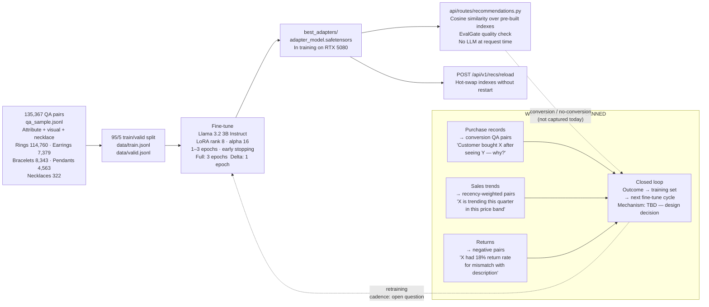

# BE ORE — Data Flow, System Architecture, and Data Access Rationale

**Audience:** Rajeev Gollamudi, Asad Mohammed (Data Engineering / BI), Marketing, Merchandising  
**Author:** Growth Engineering  
**Date:** August 2026  
**Status:** Draft — Internal Review  

> **Reading this doc:** Every component is labeled **IMPLEMENTED**, **PARTIAL**, **PLANNED**, or **UNVERIFIED**. Nothing aspirational is presented as current state. Where the code contradicts prior claims, this document flags it explicitly.

---

## 1. System-Level Flow Diagram

The diagram below uses two visual conventions:
- **Solid lines** = data connections that exist and run today
- **Dashed lines** = data connections that are requested but not yet built
- **Gray subgraph** = the six datasets from the pending Confluence access request (ECommerce + Digital Product, page 4552097803)

---

## 2. Training Path Detail

---

## 3. Stage-by-Stage Narrative

### Stage 1 — Ingestion · **IMPLEMENTED**
**File:** `workflows/product-recommendations/v2/ingest_rings.py` (and equivalents per category)

Reads structured CSV exports from Brilliant Earth merchandising tools. For rings, inputs are `resources/merchandiser-priorities/CYO_Rings.csv` and `Wedding_Bands.csv`. Each row is expanded across metal variants (14KW, 18KW, 14KY, 18KY, 14KR, PT, and others) using a hardcoded metal code list. Image URLs are resolved via `resources/image-url-cache.json`. Output is `resources/site_search_{category}.json` — one record per SKU.

**Total SKUs loaded:** 8,617 across 5 categories (rings, earrings, bracelets, pendants, necklaces).

> **Note:** 85 products fail image enrichment due to VTO (virtual try-on) image URLs returning 403 Forbidden. These SKUs receive DNA-only knowledge cards with `visual.enriched = False`.

---

### Stage 2 — DNA Profiles · **IMPLEMENTED**
**File:** `shared/product_dna.py`, orchestrated by `build_profiles.py`

Builds a structured attribute record (the "DNA") for each SKU from the ingested catalog fields. Fields include: `style_tier`, `style_movement`, `occasion_tier`, `gem_family`, `gem_shape`, `metal_primary`, `setting_style`, `ring_subtype`, `visual_weight`, `is_stackable`, `shank_style`, truncated description. Output: `output/v2/unified_profiles/unified_{category}.json`.

---

### Stage 3 — Visual Enrichment · **PARTIAL**
**File:** `workflows/product-recommendations/v2/ingest_visual_enrichment.py`

Calls `claude-haiku-4-5-20251001` on each product's primary image. The prompt runs a multi-expert "roundtable" — gemologist, jeweler, stylist perspectives followed by consensus — producing structured JSON with 40+ fields including `visual_era`, `design_language`, `customer_archetype_visual`, `occasion_range`, `agent_context`, and category-specific pairing intelligence. Results propagate to all metal variants of the same base design.

**Current coverage:**

| Category | Total SKUs | Enriched | Coverage | Notes |
|----------|-----------|----------|----------|-------|
| Rings | 6,418 | in progress | partial | largest category; enrichment ongoing |
| Pendants | 978 | 978 | 100% | complete |
| Bracelets | 642 | 642 | 100% | complete |
| Earrings | 531 | 531 | 100% | complete |
| Necklaces | 23 | 23 | 100% | new category; necklace-specific prompt added Aug 2026 — re-enrich needed |

Necklaces were added as a category in Aug 2026. The 23 existing profiles were enriched using the generic rings prompt and lack necklace-specific fields (chain style, wearing length, layering logic). Re-running `ingest_visual_enrichment.py --category necklaces` will apply the correct prompt. The full necklace catalog CSV has not yet been confirmed — only 23 profiles exist.

---

### Stage 4 — Knowledge Card Compilation · **IMPLEMENTED** (with one caveat)
**File:** `ml/knowledge_compiler.py`

Merges unified profiles into structured knowledge cards: `{sku: {dna: {...}, visual: {...}, derived: {...}}}`. The `derived` layer computes `feature_completeness` (float 0–1, DNA 60% weighted, visual 40%) and `visual_enriched` (bool).

**⚠ Caveat:** The `knowledge_compiler.py` docstring describes a `behavioral` layer — *"What 7.8M training decisions have taught the system"* — but `build_knowledge_card()` does not populate this key. Code that reads `card.get("behavioral", {})` (specifically `ml/product_expert.py`) always receives an empty dict. The behavioral layer is **documented but not implemented.**

---

### Stage 5 — Vector Embeddings · **IMPLEMENTED**
**File:** `ml/product_encoder.py`

Encodes knowledge card text documents to 384-dimensional dense vectors using `all-MiniLM-L6-v2` (sentence-transformers). Fine-tuned variants exist on disk for all 4 categories (`output/v2/knowledge/embeddings/finetuned_{category}/`). At inference time, `jewelry_chatbot.py` loads whichever model is referenced in `model_info_{category}.json`.

Embeddings are built from the `visual` layer fields — specifically the compiled document text. DNA-only SKUs produce lower-quality embeddings because the richer contextual fields (`agent_context`, `design_language`, `identity_signal`) are absent.

---

### Stage 6 — Training Data Generation · **IMPLEMENTED**
**File:** `ml/generate_training_data.py`

Generates 8–12 QA pairs per enriched product across 12 question types: design character, era, occasion, identity/archetype, pairing logic, quality register, similarity reasoning, material composition, subtype classification, and product lookup by name or SKU. Category-specific extras: ring band pairing, earring face-framing, bracelet stack logic, pendant chain logic.

**Only visually enriched products contribute training pairs** (those where `enriched=True` and no `_propagated_from` flag). Unenriched ring SKUs do not appear in the training set.

**Output:** `output/v2/training/qa_sample.jsonl` — 135,367 pairs across 5 categories. All training signal is attribute-derived and vision-derived. No purchase signal, no conversion signal. User feedback (thumbs up/down) now feeds incremental delta retrains via the queue system.

---

### Stage 7 — LLM Fine-Tuning · **IMPLEMENTED**
**Files:** `ml/finetune_pytorch.py` (CUDA/NVIDIA), `ml/finetune_llama.py` (MLX/Apple Silicon)

Applies LoRA fine-tuning to `meta-llama/Llama-3.2-3B-Instruct` using the Llama instruct chat template. Adapter config: rank 8, alpha 16, dropout 0.05, target modules `q/k/v/o_proj`, `gate/up/down_proj`. Training completed to checkpoint 15,864 (~3 epochs over the training split). Best checkpoint selected by minimum `eval_loss`.

Adapter stored at: `output/v2/training/adapters/best_adapters/adapter_model.safetensors`

---

### Stage 8 — Serving · **IMPLEMENTED**
**File:** `api/routes/recommendations.py`

The rec engine is deterministic — no LLM runs at request time. Per request:

1. Load pre-built embedding index for the requested category (cached in memory after first request)
2. Query index for nearest neighbors by rec type (`similar_style` → similarity index, `pairs_with` → pairing index, `complete_look` → look index)
3. Apply business rule filters inside `RecEngine` (metal match, form-factor gates, diversity dedup)
4. Score results against QA ground truth via `EvalGate` — flags results below the 0.72 threshold that aren't corroborated by training data
5. Return ranked SKU list with scores, gate annotations, and `method: "embedding_cosine_similarity"`

Hot-swap: `POST /api/v1/recs/reload` clears the in-memory index cache and reloads from disk. No API restart required after a new index build.

> **Note:** `ml/consultation_server.py` (port 7434, RAG + LLM) was a POC for the Llama fine-tune interface. It is not the production serving layer and is not maintained going forward. The rec API above is the system of record.

---

## 4. What Each Requested Dataset Contributes

| Dataset | Priority | Where It Enters | What It Becomes | Capability It Unlocks | Status |
|---------|----------|----------------|-----------------|----------------------|--------|
| **Product Sales Data** SKU × day × channel | HIGH | Stage 6 — training data generation | Trend-weighted QA pairs: recency signal, velocity, price-band performance | Model understands which products are currently performing; can surface trending items vs. stagnant inventory | NOT CONNECTED |
| **Customer Purchase Records** Anonymized order line item | HIGH | Stage 6 — training data generation | Conversion QA pairs: "customer browsed X, purchased Y — what made Y the right choice?" | Model learns from actual purchase decisions, not just product attributes; recommendations weighted toward conversion-proven items for similar customer profiles | NOT CONNECTED |
| **Product Catalog & Attribute Data** ER/WB/FJ, DYO/Preset, Lab/Natural, metal, price band | HIGH | Stage 1–2 — ingestion and DNA build | Richer DNA fields: product type classification, lab vs. natural distinction, DYO vs. preset flag | Recommendations can filter and rank by product type distinctions not currently in the catalog CSVs; improves precision for ER-specific and WB-specific queries | NOT CONNECTED — partial overlap with current CSVs, scope of delta unknown |
| **Purchase Sequence & Attach Rate** ER→WB attach, time between purchases | HIGH | Stage 4 — knowledge cards / agent ensemble | Attach-rate priors in `agents/merchandiser_prior_agent.py` and pairing seeds | Pairing recommendations backed by actual co-purchase data, not just aesthetic compatibility; ER→WB suggestions informed by real attach rates by SKU | NOT CONNECTED — `merchandiser_prior_agent.py` stub exists in agents/ but reads from hand-curated priors only |
| **Website Interaction Data** Browse paths, PDP views, search queries, add-to-cart | MEDIUM | Stage 8 — serving layer | Session signals with persistence beyond session lifetime; longer-horizon personalization | Search ranking personalized to returning customers; consideration-stage signals inform what to surface earlier in the browse journey | PARTIAL — in-session events tracked today in `consultations.db`; no cross-session persistence or training feed |
| **Returns & Cancellation Flags** Order line item | MEDIUM | Stage 6 — training data generation | Negative training pairs: products flagged with high return rate for description mismatch become negative examples | Model learns which recommendation contexts produce dissatisfaction; reduces repeat of patterns associated with returns | NOT CONNECTED — no negative training signal exists today beyond the agent ensemble's self-generated rejection decisions |

---

## 5. The ML in Plain Language

### What kind of system this is

BE ORE is not a collaborative filtering system. It does not work from user-item interaction matrices or compute "customers like you also bought." It has no access to any of that data today.

It is a retrieval-augmented generation (RAG) system where the retriever is a fine-tuned semantic search model and the generator is a fine-tuned language model. Both components are trained exclusively on product knowledge derived from the catalog and visual analysis.

When a query comes in:
1. The query is encoded to a vector and compared against every product's vector representation
2. The closest products by cosine similarity are retrieved
3. The language model, which has been trained on 56,194 QA pairs about those products, generates a natural-language answer using the retrieved products as context

The language model knows about products because it was trained on questions and answers about them. It does not know about customers.

### What the model learns today

Every training example is derived from the knowledge card for one product: what the product looks like, what era it belongs to, who it is designed for, what occasions it suits, what it pairs with, and how it should be described. The model learns to answer jewelry-knowledge questions about Brilliant Earth's catalog.

In practice this means:
- The model can describe any enriched product accurately in natural language
- It can surface products that match an aesthetic description ("something minimal and timeless")
- It can identify pairing logic within the catalog based on visual and design compatibility
- It cannot rank a good recommendation above a mediocre one based on what customers have actually purchased
- It does not know whether any product has sold well or poorly, been returned frequently, or driven repeat purchases

### What behavioral data would change

The current training objective is: *learn to describe products accurately and match product attributes to aesthetic queries.*

With conversion data, the training objective can become: *learn to predict which product a customer is likely to purchase, given what they said and what they browsed.*

This is a materially different objective. The training examples change from "here is what product X is" to "here is what a customer wanted, here is what they considered, and here is what they bought — understand why." The model reweights its internal representations toward patterns that precede conversion rather than patterns that describe attribute similarity.

Concretely:
- Purchase records → new QA pair type: "Customer with stated preference for X purchased Y — explain the recommendation"
- Sales trend data → recency signal in training: pairs involving trending SKUs receive higher representation in each training cycle
- Return flags → negative signal: high-return SKUs for specific query contexts become examples of what not to recommend

### What the system does not do and will not do

- **No real-time learning.** The model does not update between training runs. A recommendation served today does not make the next recommendation smarter unless a full training cycle runs.
- **No user identity.** The system uses anonymous session-level signals. There is no concept of a returning customer's long-term history unless purchase records are integrated.
- **No A/B testing framework.** There is no mechanism today to compare model versions on live traffic and measure which performs better. This is a design decision that would need to be made.
- **No price optimization.** The system recommends based on style and attribute fit. It does not factor in margin, inventory levels, or promotional priorities unless those signals are explicitly added to the training set.

---

## 6. The Feedback Loop — Honest State

### Today: partially closed via user feedback

The rec engine logs every recommendation event. Users can rate each result (thumbs up/down, reason code, free-text note) inline in the demo UI via `POST /api/v1/training/feedback`.

Feedback flows into the RuleCrystallizer immediately (background task, non-blocking) — each thumbs-up/down is recorded as a `good`/`bad` decision on the structural pattern that produced the pairing. Crystallized rules now carry `signal_source: "catalog_structure+user_feedback"` to distinguish them from purchase-validated rules.

Feedback also accumulates in the `training_feedback` table. Once a SKU reaches the threshold (≥3 feedback items), it qualifies for targeted retraining. `POST /api/v1/training/queue/flush` creates a `TrainingQueue` job; `python core/ml/feedback_trainer.py --job-id N` runs an incremental fine-tune against just those SKUs (1 epoch, attention-only LoRA, 512-token cap) without touching the rest of the catalog.

The agent ensemble (`agents/`) and active learners remain self-supervised — they validate pairs against each other using the same catalog knowledge they were built from. This improves internal consistency but does not improve alignment with what customers actually want. Crystallized rules are labeled `catalog_structure` until user feedback is recorded against them.

**The 7.8M training decisions claim in `knowledge_compiler.py` has been removed.** No code produces or reads a decision count at that scale.

### With purchase and interaction data: the loop fully closes

When purchase records are available:

1. A recommendation is served and logged with an event ID
2. Purchase records join to that event (on customer key or session key — **join key is a design decision**)
3. Converted SKUs → positive training examples; high-ranked but not purchased → negative examples
4. New QA pairs enter the training queue alongside user feedback
5. Incremental fine-tune from last checkpoint; hot-swap via `POST /api/v1/recs/reload`

### Measurement

**Offline evaluation today:** `eval_loss` on the validation split of `qa_pairs.jsonl`. This measures whether the model predicts its own training answers well. It does not measure recommendation quality or customer satisfaction.

**No live performance measurement exists.** There is no baseline metric, no A/B framework, no conversion tracking tied to recommendations.

**What measurement would look like with the data:**
- Baseline: attach rate for ER→WB before BE ORE recommendations are active
- Treatment: attach rate for sessions that used the consultation tool
- Metric: conversion rate of surfaced SKUs; return rate of recommended SKUs; time-to-purchase

Who sees this report and how often is an open design question.

### Retraining cadence

Two modes:
- **Full retrain:** `python core/ml/finetune_pytorch.py` — 3 epochs over all 135k pairs. Runs on the RTX 5080 Windows machine. Manual trigger. Current run in progress.
- **Delta retrain:** `python core/ml/feedback_trainer.py --job-id N` — 1 epoch, attention-only LoRA, targeted QA pairs for rated SKUs only + 500-pair baseline sample. Triggered by `POST /api/v1/training/queue/flush` once feedback threshold is met. Hot-swapped via `POST /api/v1/recs/reload` without API restart.

Degradation if retraining does not run: the LLM adapter becomes stale relative to catalog changes (new products, discontinued SKUs, updated enrichment). The embedding index and knowledge cards update independently of the LLM, so search quality degrades more slowly than generative answer quality.

---

## 7. Current State vs. Future State

| Question | System Can Answer Today | System Can Answer With Requested Data |
|----------|------------------------|---------------------------------------|
| "What ring feels modern but timeless?" | Yes — semantic match on visual era and design voice | Yes, plus: weighted toward rings that customers with similar stated preferences have purchased |
| "What wedding band pairs with this ER?" | Yes — visual and design compatibility scoring | Yes, plus: ER→WB attach rate by specific SKU; recommendations backed by co-purchase data |
| "What's trending right now in solitaires?" | No — model has no time signal | Yes — trend-weighted training from sales velocity data |
| "What did customers like this one end up buying?" | No — no purchase history | Yes — with anonymized purchase records by cohort |
| "What should I avoid recommending?" | Partial — agent ensemble rejects incompatible pairs, but no return-rate signal | Yes — high-return SKUs for specific query contexts become negative training examples |
| "Is this recommendation working?" | No — no outcome measurement | Possible — with conversion tracking tied to served recommendations |
| "Who is this customer and what have they bought before?" | No — session only, no returning customer identity | Partial — anonymized purchase history by customer key, not identity |
| "Which products are overstocked or need to move?" | No — no inventory signal | Not in scope of this request |

---

## 8. Open Questions

### For the data team

1. **Product catalog delta:** The current ingestion CSVs cover rings and wedding bands. What is the format and update cadence for earring, pendant, and bracelet catalog data? Is the full attribute set (ER/WB/FJ classification, DYO vs. Preset, Lab vs. Natural) available at SKU level in a single exportable table?
2. **Customer key:** What anonymized identifier would link purchase records to session events? The consultation server does not currently collect a customer identifier at session start. Is there a session token or device ID that could be joined, or would the link be probabilistic?
3. **Sales data grain:** Is SKU × day × channel available for the full catalog history, or only a rolling window? How far back does it go?
4. **Purchase sequence data:** Is the ER→WB attach rate query answerable from raw order line items, or does it require a pre-aggregated table? Who owns this computation today?
5. **Return flags:** Are returns captured at order line item level with a reason code? If reason codes exist, which ones indicate a description or expectation mismatch (relevant as a training signal) vs. sizing or fit issues (less relevant)?
6. **Interaction data:** Is website event data available in a warehouse query (Snowflake/BigQuery), or would this require an integration with the analytics platform? What is the retention window?
7. **Refresh cadence:** The data access request leaves cadence open. For sales and trend data, a weekly export is likely the minimum useful signal. For purchase records, monthly may be sufficient for training purposes. What is feasible?

### Design decisions on our side

1. **Join key for closing the loop:** The consultation server does not log a customer ID. To close the feedback loop, either (a) the server must begin capturing an identifier (session token, hashed email at login) that can be joined to purchase records, or (b) the signal is aggregate-only (no per-session conversion tracking). Option (b) is easier to implement but loses per-recommendation signal.
2. **Negative example construction:** How to construct training examples from browsed-but-not-purchased SKUs. Not every browse represents a rejection — the customer may have abandoned for unrelated reasons. A minimum dwell time or engagement signal (e.g., `compare` or `inquire` event followed by no purchase) is a better negative signal than a raw view.
3. **Retraining trigger:** Whether retraining runs on a schedule (weekly, monthly) or on a signal (e.g., when a defined volume of new conversion pairs is available). The current manual process does not scale.
4. **Adapter hot-swap:** The server loads the LLM adapter once at startup. A retraining cycle produces a new adapter at `best_adapters/`. A reload mechanism (graceful restart or dynamic adapter loading) is needed for the updated model to serve requests without downtime.
5. **Evaluation framework:** Before measuring improvement, a baseline must be established. The team needs to agree on the metric (attach rate, conversion rate, return rate), the comparison window, and who owns the report.
6. **Scope of the behavioral layer:** The `knowledge_compiler.py` docstring describes a `behavioral` key per knowledge card that does not exist. If behavioral data is granted, the decision of whether to surface it at the card level (making it available to search and the agent ensemble) vs. only at training time needs to be made.

---

## 9. Discrepancies Between This Document and the Confluence Access Request

The following items in the existing Confluence page (ECommerce + Digital Product, page 4552097803) should be corrected before the request goes out:

| Claim in Confluence Request | Actual State | Correction |
|-----------------------------|--------------|------------|
| "8,338 products enriched across all categories" | 8,617 total SKUs across 5 categories. Rings enrichment is ongoing. | Update to current category-level counts per the Stage 3 table above. |
| "Total AI cost to enrich the full catalog" | Rings enrichment is not complete. | Reframe as cost to date with estimate for remaining ring coverage. |
| Implied that the system recommends from "our full catalog" | Training data (135,367 QA pairs) comes from enriched products. Unenriched rings appear in search via embeddings but do not contribute training pairs. | Clarify accordingly. |
| "7.8M training decisions" | Claim removed from `knowledge_compiler.py`. No code produces or reads a decision count at that scale. | Remove entirely — not aspirational, just incorrect. |
| Serving layer described as `consultation_server.py` + LLM at query time | Serving is now `api/routes/recommendations.py` — deterministic cosine similarity, no LLM at request time. | Update to current architecture. |

---

*Document generated from codebase audit. All file paths, counts, and schema fields verified against live repository state as of August 2026.*
